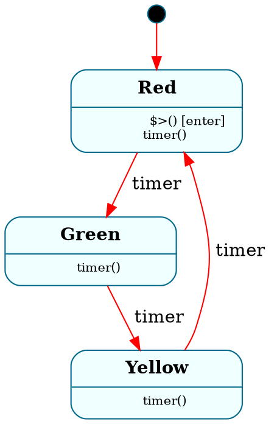
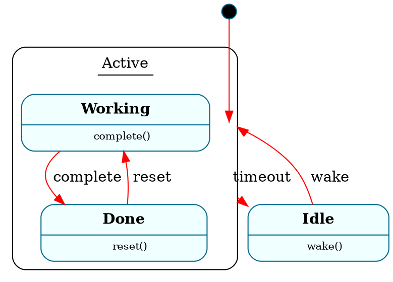
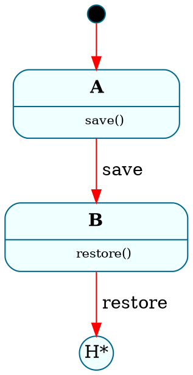
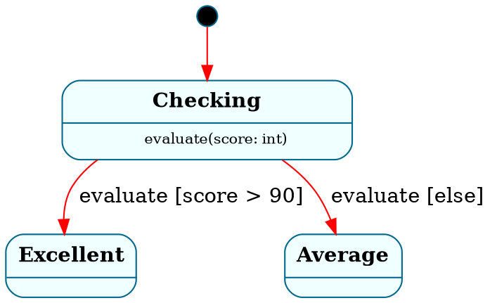

# GraphViz Backend Architecture for Frame V4

## Status
**Proposal** — Design document for implementing GraphViz DOT generation in the V4 pipeline.

## Problem Statement

The Frame transpiler advertises GraphViz as a supported target language (`framec -l graphviz`), but no V4 backend exists. The `TargetLanguage::Graphviz` enum variant is parsed successfully by the CLI, but `get_backend()` falls through to a wildcard `_ =>` arm that **silently returns a Python backend**, producing Python code when the user asked for a state machine diagram.

### History

A working GraphViz visitor existed in the V3 pipeline (commit `7b475407`, March 2024, authored by DeepaK Sharma). It was enhanced for multi-system support in v0.58 (commit `5d00948c`, September 2025). It was deleted along with all V3 visitors in the `v3_architecture` cleanup (commit `5c8103e7`).

The V3 visitor emitted **DOT format** (not SVG). Key features:
- States rendered as HTML-label table nodes with rounded borders
- HSM parent states rendered as `subgraph cluster_StateName { }`
- Transitions as labeled edges with event names
- Entry point as a filled black circle
- State stack pop targets as `H*` circle nodes
- Multi-system via `run_v2()` returning `Vec<(String, String)>`

### V3 GraphViz Visitor — Detailed Analysis

The V3 visitor (2287 lines at v0.58, extracted from commit `5d00948c`) provides the reference implementation for what the V4 backend must reproduce and improve. This section documents exactly what the V3 visitor did, what it was missing, and what V4 will add.

#### What V3 Produced (Preserved in V4)

**Graph globals** (`visit_system_node`, line 842):
```dot
digraph SystemName {
    compound=true
    node [color="deepskyblue4" style="rounded, filled" fillcolor="azure"]
    edge[color="red"]
    ...
}
```
These styling defaults give state machines a consistent, readable look. V4 preserves these exactly.

**Entry point** (line 858):
```dot
Entry[width=0.2 shape="circle" style="filled" fillcolor="black" label=""]
Entry -> FirstState
```
A solid black circle with an edge to the first state in the machine section. V4 preserves this.

**Leaf state nodes** (`format_state`, line 185):
```dot
StateName [label = <
    <table
        CELLBORDER="0"
        CELLPADDING="5"
        style="rounded"
    >
        <tr><td>StateName</td></tr>
        <hr/>
        <tr><td></td></tr>
    </table>
> margin=0 shape=none
]
```
HTML-label table nodes with a header row (state name), divider, and empty body row. The empty body row creates visual space. V4 preserves the HTML-label approach but **improves** the body by listing handled events.

**HSM parent states as clusters** (`format_parent_state`, line 220):
```dot
subgraph cluster_ParentState {
    label = <
        <table cellborder="0" border="0">
            <tr><td>ParentState</td></tr>
            <hr/>
            <tr><td></td></tr>
        </table>
    >
    style = rounded
    ParentState [shape="point" width="0"]

    // Child states are rendered inside this cluster
    ChildState [label = <...> margin=0 shape=none]
}
```
Key details:
- Parent states become `subgraph cluster_Name {}` — GraphViz renders these as visual containers
- An **invisible anchor node** (`shape="point" width="0"`) with the parent's name is placed inside the cluster — this is the edge target for transitions from parent states
- Child states are rendered nested inside the cluster
- `style=rounded` gives the cluster rounded corners matching the state node style

**Recursive hierarchy** (`generate_states`, line 136):
The V3 visitor walks the `SystemHierarchy` tree recursively. At each node:
- If the node has children → `format_parent_state()` (creates `subgraph cluster_`)
- If the node is a leaf → `format_state()` (creates HTML-label node)
- Then recurses into children
- After children, closes the `}` for parent clusters

This correctly handles multi-level nesting (grandparent → parent → child).

**Compound edges from HSM parent states** (`generate_state_ref_transition`, line 654):
```dot
// Normal transition from leaf state
Source -> Target [label=" eventName "]

// Transition from parent state (uses compound edge)
Source -> Target [label=" eventName " ltail="cluster_ParentState"]
```
The visitor checks `system_hierarchy.get_node(&current_state)` — if the current state has children, it uses `TransitionLabelType::FromCluster` which adds `ltail="cluster_StateName"`. This tells GraphViz to draw the edge as originating from the cluster boundary, not from the invisible anchor point. Requires `compound=true` in graph globals.

**State stack pop / History** (`generate_state_stack_pop_transition`, line 734):
```dot
Stack[shape="circle" label="H*" width="0" margin="0"]
CurrentState -> Stack [label=" eventName "]
```
Creates a circle node labeled `H*` (deep history notation from UML) and an edge from the current state to it. The `H*` node represents "pop from state stack and transition to whatever state was saved."

**Transition labels** (`format_transition_label`, line 709 + `generate_state_ref_transition` line 679):
- Normal: `[label=" eventName "]` (padded with spaces for readability)
- From cluster: `[label=" eventName " ltail="cluster_StateName"]`
- **User-provided labels override event name**: If a transition has an explicit label (e.g., `-> "Path A" $Target`), the label text replaces the event name on the edge. The V3 code checks `transition_expr_node.label_opt` — if `Some(label)`, uses it; if `None`, falls back to `self.event_handler_msg` (the event handler's name)
- Pipe characters in labels are escaped: `|` → `&#124;` for HTML-label safety
- This applies to both normal transitions and state stack pop transitions (same pattern at lines 679 and 812)

**Multi-system output** (`run_v2`, line 357):
```rust
pub fn run_v2(&mut self, system_node: &SystemNode) -> (String, String) {
    self.reset();
    system_node.accept(self);
    (self.system_name.clone(), self.code.clone())
}
```
The caller iterates multiple systems, calls `reset()` + `run_v2()` for each, and collects `Vec<(String, String)>`. The concatenated output uses `// System: Name` headers for the VSCode extension parser.

#### What V3 Was Missing (V4 Improvements)

| Feature | V3 Status | V4 Plan |
|---|---|---|
| **Change-state (`->>`)** | Not implemented | Dashed edge: `style="dashed"` |
| **Parent forward/dispatch (`=>`)** | No-op (line 2245: "doesn't need to generate runtime behavior") | Dotted blue edge: `style="dotted" color="blue"` |
| **Guarded transitions** (`if x -> $S`) | TODO (line 484: "TODO: Implement if statement visualization") | Edge with guard in label: `[label=" event [condition] "]` |
| **Event handler list in state nodes** | Empty body row (`<tr><td></td></tr>`) | List of handled events in body: `timeout()\nclick(x)` |
| **State variables** | Not shown | Section in node label below handler list |
| **State parameters** | Not shown | Shown in state header: `StateName(p: type)` |
| **Enter/exit annotations** | Not shown | Icons or markers in handler list: `$>() [enter]` |
| **For/While/Match branching** | All TODO (lines 487-508) | Recurse into control flow to extract nested transitions |
| **Multiple transitions per handler** | Partially — only found first transition | Walk full handler body recursively |
| **Edge labels for change-state** | N/A (change-state not implemented) | Same event-label format, with dashed line style |

#### V3 Architecture Patterns Preserved in V4

The V3 visitor used several patterns that worked well and should be preserved:

1. **Two-pass collection**: States accumulated in `self.states`, transitions in `self.transitions`, then combined at the end of `visit_system_node`. V4's IR approach (`SystemGraph`) achieves the same separation more cleanly.

2. **`SystemHierarchy` for HSM tree**: The V3 visitor received a pre-built `SystemHierarchy` with parent/child relationships. V4 builds this from `SystemAst` state declarations (`parent` field on `StateAst`).

3. **Event name as default label**: `self.event_handler_msg` tracked the current event handler name and was used as the default transition label. V4's `TransitionEdge.event` field serves the same purpose.

4. **Compound edges require `compound=true`**: This graph-level attribute is essential for `ltail`/`lhead` to work. V4 always emits it.

### VSCode Extension (Existing Consumer)

The Frame VSCode extension (`/Users/marktruluck/vscode_editor/`) has a complete GraphViz rendering pipeline that consumes the transpiler's DOT output. This is the primary consumer and must remain compatible.

**Extension pipeline**:
```
.frm file
    ↓
framec -l graphviz (via src/utils.ts, line ~15-78)
    ↓  outputs DOT text
parseGraphVizOutput() (src/helpers/graphviz.ts, line 21-63)
    ↓  regex parses single or multi-system DOT blocks
renderSystemsToSvg() (src/helpers/graphviz.ts, line 68-92)
    ↓  @viz-js/viz v3.4.0 (Emscripten-compiled GraphViz WASM) converts DOT → SVG
svgToDataUrl() (src/helpers/graphviz.ts, line 97-100)
    ↓  encodes as data:image/svg+xml URL
Webview  panel (src/handlers.ts)
    ↓  zoom/pan controls, copy-as-PNG, save-as-SVG
```

**Key extension implementation details**:

- **DOT → SVG happens in the extension**, not the transpiler. The extension bundles `@viz-js/viz` v3.4.0 (a full WASM build of GraphViz's `dot` engine). The transpiler only needs to produce valid DOT text.

- **Multi-system parsing** (`src/helpers/graphviz.ts`): Already implemented. The extension uses a regex to detect the concatenated format:
  ```
  // System: TrafficLight
  digraph TrafficLight { ... }

  // System: Elevator
  digraph Elevator { ... }
  ```
  Falls back to single `digraph` detection. Returns `{ isSingle, systems[], currentSystem }`.

- **Multi-system UI** (`src/handlers.ts`, lines 611-959): `getWebviewMultiSystem()` provides a dropdown selector to switch between systems, with a system counter badge. The user's selected system is persisted per-document via context storage.

- **Single-system UI** (`src/handlers.ts`, lines 261-443): `getWebview()` shows SVG in an `` tag with zoom in/out buttons, copy-to-clipboard (canvas-based PNG conversion), and save-as-SVG.

- **Transpiler invocation modes** (`src/utils.ts`):
  - Binary mode: `execFile(transpilerPath, ['-l', 'graphviz'], callback)` with source on stdin
  - WASM mode: `frameWasm.run(fileContent, 'graphviz')` (in-process)

- **File save behavior** (`src/utils.ts`, lines 101-104): When target is `graphviz`, the extension saves the rendered **SVG** content (not DOT), writing it with a `.svg` extension.

- **Language definition** (`src/models/languages.ts`):
  ```typescript
  Graphviz: { id: "graphviz", name: "DOT", ext: "svg" }
  ```
  Note: the extension expects `ext: "svg"` for the saved file, while the transpiler's `TargetLanguage::file_extension()` returns `"graphviz"`. This mismatch is cosmetic since the extension handles file saving independently.

- **Notebook support** (`src/notebook/frameNotebookProvider.ts`): A `%%frame_viz` magic command transpiles to GraphViz and renders SVG inline in Jupyter notebook output cells. Supports `--debug`, `--interactive`, and `--animate` flags.

- **Debug protocol** (`src/debug/FrameDebugProtocolExtensions.ts`): Defines `FrameVisualizationRequest` interface with `format: 'svg' | 'json' | 'png'` and type `'stateMachine' | 'eventQueue' | 'performanceTimeline' | 'memoryUsage'`. Currently defined but not yet wired up.

- **SVG zoom controls** (`media/js/image.js`): Max viewport 90vw × 90vh, 50px zoom increments, double-click resets, responsive dimension display.

- **Empty graph fallback** (`src/models/constants.ts`): `EMPTY_GRAPH` constant provides a placeholder DOT graph when no system is found.

### Compatibility Requirements

The V4 GraphViz backend must produce output that the existing VSCode extension can consume without modification:

1. **Output format**: Valid DOT language text (not SVG, not JSON)
2. **Single-system output**: A single `digraph SystemName { ... }` block
3. **Multi-system output**: Concatenated DOT blocks with `// System: Name` comment headers (matched by the extension's regex parser)
4. **DOT dialect**: Must be compatible with `@viz-js/viz` v3.4.0 (which implements GraphViz 9.0.0 features including HTML labels, subgraph clusters, compound edges)
5. **No external dependencies**: The extension handles DOT→SVG conversion; the transpiler must not require `dot` to be installed

## Design Principles

1. **No hacks** — Clean architecture that fits the V4 pipeline naturally
2. **Direct AST-to-DOT** — Bypass `CodegenNode` IR (designed for imperative code, wrong abstraction for declarative graphs)
3. **Rich output** — Not just topology; include event labels, HSM hierarchy, enter/exit annotations, state variables
4. **Multi-system** — Handle files with multiple `@@system` blocks
5. **Extensible** — Architecture supports future SVG direct output, JSON graph output, or interactive diagram formats

## Architecture Decision: Bypass CodegenNode

### Why Not Use LanguageBackend?

The existing V4 codegen pipeline is:

```
SystemAst → generate_system() → CodegenNode::Class → backend.emit() → language code
```

`CodegenNode` models imperative code constructs: classes, methods, if/else, assignments, loops. A GraphViz backend would need to:
- Ignore 90% of CodegenNode variants (VarDecl, Assignment, While, For, etc.)
- Reconstruct graph topology from flattened method bodies
- Lose semantic information that was available in the SystemAst (e.g., which handler a transition belongs to, HSM parent relationships)

This is the wrong abstraction. Forcing DOT generation through `CodegenNode` would be a hack.

### The Right Approach: GraphViz IR

Introduce a **GraphViz-specific intermediate representation** that captures graph semantics directly from `SystemAst` + `Arcanum`, then emit DOT from that IR.

```
SystemAst + Arcanum → GraphVizIR → DOT emitter → DOT text
```

This parallels the existing pipeline's separation of concerns:
- **Existing**: SystemAst → CodegenNode (language-agnostic IR) → Backend emitter (language-specific)
- **GraphViz**: SystemAst → GraphVizIR (graph-specific IR) → DOT emitter (format-specific)

The IR layer makes it possible to later add SVG or JSON emitters without re-walking the AST.

## GraphViz IR Design

### Core Data Structures

```rust
/// Complete graph representation for one Frame system
pub struct SystemGraph {
    pub name: String,
    pub states: Vec<StateNode>,
    pub transitions: Vec<TransitionEdge>,
    pub entry_state: Option<String>,
    pub has_state_stack: bool,
}

/// A state in the graph
pub struct StateNode {
    pub name: String,
    pub parent: Option<String>,       // HSM parent
    pub children: Vec<String>,        // HSM children (derived)
    pub has_enter: bool,              // Has $>() handler
    pub has_exit: bool,               // Has <$() handler
    pub handlers: Vec<String>,        // Event names handled (for node label detail)
    pub state_vars: Vec<StateVar>,    // State-local variables
    pub state_params: Vec<StateParam>,// State parameters
}

/// State variable for display in node labels
pub struct StateVar {
    pub name: String,
    pub var_type: Option<String>,
}

/// State parameter for display in node labels
pub struct StateParam {
    pub name: String,
    pub param_type: Option<String>,
}

/// A transition edge in the graph
pub struct TransitionEdge {
    pub source: String,               // Source state name
    pub target: TransitionTarget,     // Target (state, stack pop, or parent forward)
    pub event: String,                // Event that triggers this transition
    pub label: Option<String>,        // User-provided label (e.g., -> "Path A" $Target)
                                      // When present, REPLACES event name on the edge label.
                                      // When None, the event name is used as the label.
                                      // Pipe chars (|) must be escaped to &#124; in DOT output.
                                      //
                                      // PARSER STATUS: Labels are defined in the grammar but not
                                      // yet captured by either parser path:
                                      //   - pipeline_parser: Token::StringLit after Arrow falls
                                      //     through to `_ => {}` (line 675)
                                      //   - frame_statement_parser: identifier labels are skipped
                                      //     (lines 85-93), string labels not handled at all
                                      //   - TransitionAst, MirItem::Transition: no label field
                                      // Requires: label field on TransitionAst + MirItem + parser fix
    pub kind: TransitionKind,         // Transition vs change-state vs forward
    pub guard: Option<String>,        // Condition text (from if-branch)
}

/// What a transition points to
pub enum TransitionTarget {
    State(String),                    // Named target state
    StackPop,                         // Pop from state stack ($$[->>])
    ParentForward,                    // Forward to parent (HSM =>)
}

/// Visual distinction for edge types
pub enum TransitionKind {
    Transition,                       // -> (full transition with enter/exit)
    ChangeState,                      // ->> (direct state change, no enter/exit)
    Forward,                          // => (forward event to parent)
}
```

### Building the IR from SystemAst

```rust
/// Build a GraphVizIR from a parsed Frame system and its symbol table
pub fn build_system_graph(system: &SystemAst, arcanum: &Arcanum) -> SystemGraph {
    // 1. Collect states from MachineAst
    // 2. For each state, record parent, handlers, enter/exit, state vars
    // 3. Walk handler bodies to extract transitions (recursing into if/else branches)
    // 4. Identify entry state (first state in machine block)
    // 5. Detect state stack usage
}
```

The handler body walker must recurse into control flow to find transitions inside conditionals:

```rust
/// Recursively extract transitions from handler body statements
fn extract_transitions(
    statements: &[Statement],
    source_state: &str,
    event: &str,
    guard_context: Option<&str>,  // Accumulated condition text from enclosing if
) -> Vec<TransitionEdge> {
    // For each statement:
    //   Statement::Transition → create TransitionEdge
    //   Statement::If → recurse into then/else with guard annotation
    //   Statement::Forward → create forward edge
    //   Statement::StackPop → create stack-pop edge
    //   Others → skip (native code, expressions — not graph-relevant)
}
```

## DOT Emitter

The DOT emitter converts `SystemGraph` → DOT text. This is a straightforward mapping:

### Node Rendering

**Leaf states** (no HSM children) — V3 format preserved, with V4 improvements:

V3 had an empty body row. V4 populates it with handler list and optional state variables:
```dot
// V3 (preserved structure, empty body):
StateName [label = <
    <table CELLBORDER="0" CELLPADDING="5" style="rounded">
        <tr><td>StateName</td></tr>
        <hr/>
        <tr><td></td></tr>
    </table>
> margin=0 shape=none]

// V4 (same structure, enriched body):
StateName [label = <
    <table CELLBORDER="0" CELLPADDING="5" style="rounded">
        <tr><td><b>StateName</b></td></tr>
        <hr/>
        <tr><td align="left"><font point-size="10">
            $&gt;() [enter]<br/>
            &lt;$() [exit]<br/>
            timeout()<br/>
            click(x: int)
        </font></td></tr>
    </table>
> margin=0 shape=none]

// V4 with state variables (adds a second section):
StateName [label = <
    <table CELLBORDER="0" CELLPADDING="5" style="rounded">
        <tr><td><b>StateName</b></td></tr>
        <hr/>
        <tr><td align="left"><font point-size="10">
            $&gt;() [enter]<br/>
            click(x: int)
        </font></td></tr>
        <hr/>
        <tr><td align="left"><font point-size="9" color="gray40">
            count: int<br/>
            label: str
        </font></td></tr>
    </table>
> margin=0 shape=none]
```

The body enrichments are additive — a state with no special features renders identically to V3.

**Parent states** (HSM — have children) — V3 format preserved exactly:
```dot
subgraph cluster_ParentState {
    label = <
        <table cellborder="0" border="0">
            <tr><td>ParentState</td></tr>
            <hr/>
            <tr><td></td></tr>
        </table>
    >
    style = rounded
    ParentState [shape="point" width="0"]  // invisible anchor for compound edges

    // Child states rendered inside the cluster
    ChildState1 [label = <...> margin=0 shape=none]
    ChildState2 [label = <...> margin=0 shape=none]
}
```
The invisible anchor node (`shape="point" width="0"`) is critical — it gives compound edges (`ltail`) a target node inside the cluster. Without it, GraphViz has no edge endpoint.

**Entry point** — V3 format preserved exactly:
```dot
Entry[width=0.2 shape="circle" style="filled" fillcolor="black" label=""]
Entry -> FirstState
```

**State stack target (History)** — V3 format preserved exactly:
```dot
Stack[shape="circle" label="H*" width="0" margin="0"]
```
The `H*` label follows UML deep history notation. The node is created when a state stack pop (`$$[->>]`) is found.

### Edge Rendering

**V3 preserved patterns** (transitions and compound edges):
```dot
// Normal transition — V3 format preserved
Source -> Target [label=" eventName "]

// Transition with user-provided label — V3 format preserved
// Frame syntax: -> "Path A" $Target  →  label text replaces event name
Source -> Target [label=" Path A "]

// Transition from HSM parent state — V3 compound edge preserved
// The source node is the invisible anchor inside the cluster.
// ltail tells GraphViz to visually originate the edge from the cluster boundary.
Source -> Target [label=" eventName " ltail="cluster_ParentState"]

// State stack pop — V3 format preserved (edge to H* node)
CurrentState -> Stack [label=" eventName "]
```

**V4 additions** (not present in V3):
```dot
// Change-state (->> — no enter/exit — visually distinct with dashed line)
Source -> Target [label=" eventName " style="dashed"]

// Guarded transition (extracted from if-branches — guard shown in brackets)
Source -> Target [label=" eventName [x > 0] "]

// Forward to parent (=> — dotted blue line, distinct from normal transitions)
ChildState -> ParentState [label=" eventName " style="dotted" color="blue"]

// Transition to HSM parent state (needs lhead for compound edges)
Source -> ParentState [label=" eventName " lhead="cluster_ParentState"]
```

Note: `ltail` is for edges **from** a cluster, `lhead` is for edges **to** a cluster. Both require `compound=true`.

### Graph Wrapper

```dot
digraph SystemName {
    compound=true
    node [color="deepskyblue4" style="rounded, filled" fillcolor="azure"]
    edge [color="red"]

    // Entry point
    ...
    // States (with clusters for HSM)
    ...
    // Transitions
    ...
}
```

## Pipeline Integration

### Where It Plugs In

The GraphViz backend intercepts at the same point as existing backends — inside `compile_ast_based()` in `pipeline/compiler.rs` — but takes a different code path after parsing and validation:

```
Stages 0-4 are identical for all targets:
  Stage 0: Segmenter
  Stage 1: Lexer
  Stage 2: Parser → SystemAst
  Stage 3: Arcanum (symbol table)
  Stage 4: Validator

Stage 5-6 DIVERGE for GraphViz:
  Normal targets:  SystemAst → generate_system() → CodegenNode → backend.emit()
  GraphViz:        SystemAst → build_system_graph() → SystemGraph → emit_dot()

Stage 7: Assembler
  Normal targets:  Stitch prolog + generated class + epilog
  GraphViz:        Different assembly (see below)
```

### Compiler Changes

In `compile_ast_based()`, after Stage 4 validation:

```rust
if config.target == TargetLanguage::Graphviz {
    // GraphViz path: build graph IR, emit DOT
    let graph = graphviz::build_system_graph(&system_ast, &arcanum);
    let dot_code = graphviz::emit_dot(&graph);
    generated_systems.push((name.clone(), dot_code));
} else {
    // Normal path: CodegenNode → backend emit
    let codegen_node = generate_system(&system_ast, &arcanum, config.target, source);
    let system_code = backend.emit(&codegen_node, &mut ctx);
    // ... runtime classes, etc.
    generated_systems.push((name.clone(), system_code));
}
```

### Assembly Behavior

For GraphViz, the assembler should **not** interleave native code (the "oceans" in the oceans model are irrelevant for a diagram). Instead:

- **Single system**: Output the DOT directly
- **Multiple systems**: Concatenate DOT blocks with comment separators:

```dot
// Frame Module: 2 systems

// System: TrafficLight
digraph TrafficLight { ... }

// System: Elevator
digraph Elevator { ... }
```

This format is **required by the VSCode extension**. The extension's `parseGraphVizOutput()` in `src/helpers/graphviz.ts` uses the regex `/\/\/\s*System:\s*(\w+)\s*\n(digraph\s+\w+\s*\{[^}]*\})/g` to detect multi-system output and falls back to single `digraph` detection. The `// System: Name` comment headers and the `digraph Name { ... }` blocks must match this pattern.

The compiler can handle GraphViz assembly directly (it's trivial concatenation, not the complex native-code-stitching the assembler does for real languages).

### get_backend() Fix

Regardless of GraphViz implementation, the silent fallback must be fixed:

```rust
pub fn get_backend(lang: TargetLanguage) -> Box<dyn LanguageBackend> {
    match lang {
        TargetLanguage::Python3 => Box::new(python::PythonBackend),
        TargetLanguage::TypeScript => Box::new(typescript::TypeScriptBackend),
        TargetLanguage::Rust => Box::new(rust::RustBackend),
        TargetLanguage::CSharp => Box::new(csharp::CSharpBackend),
        TargetLanguage::C => Box::new(c::CBackend),
        TargetLanguage::Cpp => Box::new(cpp::CppBackend),
        TargetLanguage::Java => Box::new(java::JavaBackend),
        // GraphViz does NOT use LanguageBackend — it has its own pipeline
        // LLVM is not yet implemented
        other => panic!(
            "No backend implementation for {:?}. \
             GraphViz uses a separate pipeline; LLVM is not yet implemented.",
            other
        ),
    }
}
```

## File Organization

```
framec/src/frame_c/v4/
├── codegen/
│   ├── backends/        (existing — Python, TS, Rust, C, C++, C#, Java)
│   ├── ast.rs           (CodegenNode — NOT used by GraphViz)
│   ├── backend.rs       (LanguageBackend trait — NOT used by GraphViz)
│   └── system_codegen.rs
├── graphviz/            (NEW — self-contained GraphViz module)
│   ├── mod.rs           (public API: build_system_graph, emit_dot)
│   ├── ir.rs            (SystemGraph, StateNode, TransitionEdge structs)
│   ├── builder.rs       (SystemAst + Arcanum → SystemGraph)
│   └── dot_emitter.rs   (SystemGraph → DOT text)
├── pipeline/
│   └── compiler.rs      (modified: GraphViz branch in compile_ast_based)
└── ...
```

The GraphViz module is **self-contained** — it depends only on `frame_ast` and `arcanum`, not on `codegen/`. This keeps the architecture clean: the codegen infrastructure for imperative languages is not polluted by graph-specific concerns, and GraphViz doesn't inherit complexity it doesn't need.

## What Gets Visualized

| Frame Concept | GraphViz Representation |
|---|---|
| State (`$Name`) | Node with HTML label (name + handler list) |
| Initial state | Black filled circle → first state edge |
| Transition (`->`) | Solid edge with event label |
| Change-state (`->>`) | Dashed edge with event label |
| HSM parent state | `subgraph cluster_` containing children |
| HSM forward (`=>`) | Dotted blue edge to parent |
| Enter handler (`$>`) | Annotation in state node label |
| Exit handler (`<$`) | Annotation in state node label |
| State stack push (`$$[->]`) | (no visual — happens within handler) |
| State stack pop (`$$[->>]`) | Edge to `H*` circle node |
| Guarded transition (`if x -> $S`) | Edge with `[condition]` in label |
| Transition label (`-> "label" $S`) | User label replaces event name on edge |
| Event parameters | Shown in handler list: `click(x: int)` |
| State variables | Section in node label |
| Interface methods | Not shown (not part of state machine topology) |
| Actions | Not shown (implementation detail) |
| Operations | Not shown (implementation detail) |
| Domain variables | Not shown (not part of state machine topology) |

## What Is NOT in Scope

- **SVG generation** — The transpiler emits DOT text. The VSCode extension already handles DOT→SVG conversion via `@viz-js/viz` (GraphViz compiled to WASM). Adding a native `graphviz` system dependency to the transpiler would be redundant and create a heavy runtime requirement.
- **Interactive diagrams** — The debug protocol defines `FrameVisualizationRequest` with interactive types, but that is a future extension concern. The IR is designed to support richer emitters later.
- **Layout control** — GraphViz's `dot` engine (running in the extension via WASM) handles layout. We do not attempt to control node positions.
- **Cross-system edges** — Systems are independent graphs. No edges between systems. The extension's multi-system UI handles navigation between systems via a dropdown selector.
- **VSCode extension changes** — The extension's GraphViz pipeline (`parseGraphVizOutput` → `renderSystemsToSvg` → webview) already works. The V4 backend must produce compatible output, not require extension modifications.

## Testing Strategy

### Unit Tests

1. **IR Builder tests** — Given a `SystemAst`, verify the `SystemGraph` contains correct states, edges, and hierarchy
2. **DOT Emitter tests** — Given a `SystemGraph`, verify the emitted DOT is syntactically valid and contains expected elements
3. **Round-trip validation** — Parse a `.fpy` file → build graph → emit DOT → verify DOT parses with `dot -Tcanon` (if available)

### Integration Tests

Use existing test files from `framepiler_test_env/tests/common/primary/`:
- Simple transitions (2-3 states with transitions)
- HSM (parent/child states with forwarding)
- State stack (push/pop patterns)
- Guarded transitions (if/else with different targets)
- Multi-system files (multiple `@@system` blocks)

### Test file structure

```
framepiler_test_env/tests/common/primary/
├── graphviz_basic.fpy          # Simple state machine
├── graphviz_hsm.fpy            # Hierarchical states
├── graphviz_guards.fpy         # Conditional transitions
├── graphviz_stack.fpy          # State stack push/pop
└── graphviz_multi_system.fpy   # Multiple systems in one file
```

Expected output is DOT text that can be validated for:
- Correct node count
- Correct edge count and labels
- Proper `subgraph cluster_` nesting for HSM
- Proper entry point node

## Implementation Order

1. **Fix get_backend() silent fallback** — Immediate safety fix (independent of GraphViz)
2. **Create `graphviz/ir.rs`** — Define the IR structs
3. **Create `graphviz/builder.rs`** — SystemAst → SystemGraph extraction
4. **Create `graphviz/dot_emitter.rs`** — SystemGraph → DOT text
5. **Wire into compiler** — Add GraphViz branch in `compile_ast_based()`
6. **Handle assembly** — Either bypass assembler or add GraphViz mode
7. **Add tests** — Unit + integration tests
8. **File extension** — Change from `"graphviz"` to `"dot"` (standard extension). Note: the VSCode extension defines `ext: "svg"` for saved files but handles this independently via its own save logic, so changing the transpiler's extension won't affect it

## Future Extensions

Once the IR exists, adding new output formats is straightforward:

- **`graphviz/json_emitter.rs`** — Emit JSON graph for web-based visualization. The debug protocol already defines `FrameVisualizationRequest` with `format: 'json'`, so a JSON emitter would enable the VSCode debug adapter's visualization features.
- **`graphviz/mermaid_emitter.rs`** — Emit Mermaid syntax for Markdown-embedded diagrams (GitHub renders Mermaid natively in `.md` files)
- **`graphviz/svg_emitter.rs`** — Emit SVG directly using a Rust layout library. This would make SVG generation possible without the extension's `@viz-js/viz` WASM dependency, useful for CLI-only users and CI pipelines.
- **CLI flags**: `framec -l graphviz --format dot|json|mermaid`
- **Notebook enhancements** — The `%%frame_viz` magic command currently supports `--debug`, `--interactive`, and `--animate` flags. Richer IR could enable animated state transition playback in notebooks.
- **Debug visualizations** — The extension's `FrameDebugProtocolExtensions.ts` defines visualization types beyond `stateMachine` (`eventQueue`, `performanceTimeline`, `memoryUsage`). These could be powered by different IR views of the same system data.

## Appendix: Complete DOT Output Examples

### Example 1: Simple State Machine

**Frame source:**
```frame
@@system TrafficLight {
    machine:
        $Red {
            $>() { }
            timer() {
                -> $Green
            }
        }
        $Green {
            timer() {
                -> $Yellow
            }
        }
        $Yellow {
            timer() {
                -> $Red
            }
        }
}
```

**Expected V4 DOT output:**


### Example 2: HSM with Parent/Child States

**Frame source:**
```frame
@@system HsmExample {
    machine:
        $Active {
            timeout() {
                -> $Idle
            }

            $Working {
                complete() {
                    -> $Done
                }
            }
            $Done {
                reset() {
                    -> $Working
                }
            }
        }
        $Idle {
            wake() {
                -> $Active
            }
        }
}
```

**Expected V4 DOT output:**


Note the key HSM patterns:
- `Active` is a `subgraph cluster_Active` with an invisible anchor node
- Transition **from** `Active` uses `ltail="cluster_Active"`
- Transition **to** `Active` uses `lhead="cluster_Active"`
- Child states `Working` and `Done` are rendered inside the cluster

### Example 3: State Stack (History)

**Frame source:**
```frame
@@system StackExample {
    machine:
        $A {
            save() {
                $$[->]
                -> $B
            }
        }
        $B {
            restore() {
                $$[->>]
            }
        }
}
```

**Expected V4 DOT output:**


### Example 4: Guarded Transitions (V4 Improvement)

**Frame source:**
```frame
@@system GuardedExample {
    machine:
        $Checking {
            evaluate(score: int) {
                if score > 90 {
                    -> $Excellent
                } else {
                    -> $Average
                }
            }
        }
        $Excellent { }
        $Average { }
}
```

**Expected V4 DOT output:**


Note: Guard conditions are extracted from `if` branches and shown in brackets on the edge label. The V3 visitor had this as a TODO — it's a key V4 improvement that makes the diagram accurately represent conditional behavior.
