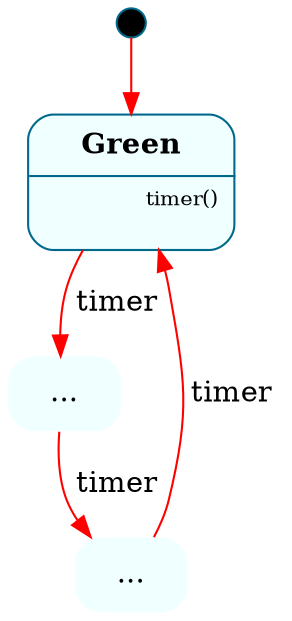

# Frame GraphViz Backend — VSCode Extension Integration Guide

**Transpiler version**: v0.96.11
**Status**: Complete and merged to `main`
**Date**: 2026-03-10

> **v0.96.11 fix**: The `-l graphviz` CLI flag was being silently overridden by the file's `@@target` pragma. Fixed in `compiler.rs` — CLI explicit flags now take precedence over in-file `@@target` declarations. Rebuild the binary to pick up this fix.

---

## 1. Overview

The Frame transpiler now has a V4 GraphViz backend that generates DOT notation from `@@system` blocks. It supports:

- Flat state machines (states + transitions)
- Hierarchical state machines (HSM) with parent/child nesting via `subgraph cluster_`
- State parameters, state variables, enter/exit handlers
- Guarded transitions (conditions shown on edge labels)
- State stack push/pop (history node `H*`)
- Multi-system files (multiple `@@system` blocks in one source file)

---

## 2. CLI Invocation

The invocation has not changed:

```bash
# CLI — stdin/stdout
echo "$frame_source" | framec -l graphviz

# CLI — file argument
framec -l graphviz path/to/file.fpy

# WASM
frameWasm.run(sourceContent, 'graphviz')
```

---

## 3. Output Format

### 3a. Single-System Output

When the source contains exactly one `@@system` block, the output is a bare `digraph`:



No header comments. Just the digraph.

### 3b. Multi-System Output

When the source contains **two or more** `@@system` blocks, the output uses this format:

```
// Frame Module: 3 systems

// System: SystemA
digraph SystemA {
    ...
}

// System: SystemB
digraph SystemB {
    ...
}

// System: SystemC
digraph SystemC {
    ...
}
```

**Key details:**
- First line: `// Frame Module: N systems`
- Each system preceded by `// System: ExactSystemName`
- System name matches the `@@system` declaration name exactly
- Blank line between systems
- Each digraph is self-contained

---

## 4. Node Format

### 4a. Leaf States (no children)

States are rendered as HTML-label nodes with up to 3 sections:

```
┌──────────────────────────────┐
│  StateName(param1: Type)     │  ← Header (bold, state params if any)
├──────────────────────────────┤
│  $>() [enter]                │  ← Handlers (10pt font)
│  eventName(p1: Type)         │
│  <$() [exit]                 │
├──────────────────────────────┤
│  varName: VarType            │  ← State variables (9pt, gray)
└──────────────────────────────┘
```

- Header always present
- Handler section omitted if no handlers, no enter, no exit
- State variable section omitted if no state vars
- HTML entities are escaped (`<` → `&lt;`, `>` → `&gt;`, etc.)

### 4b. Parent States (HSM — has children)

Parent states are rendered as **`subgraph cluster_`** blocks:

```dot
subgraph cluster_Parent {
    label = <
        <table cellborder="0" border="0">
            <tr><td>Parent</td></tr>
            <hr/>
            <tr><td></td></tr>
        </table>
    >
    style = rounded
    Parent [shape="point" width="0"]

    ChildA [label = < ... > margin=0 shape=none]
    ChildB [label = < ... > margin=0 shape=none]
}
```

**Important**: The parent has an **invisible anchor node** (`shape="point" width="0"`) used as the target/source for compound edges via `ltail`/`lhead` attributes.

**Nesting**: Children that are themselves parents create nested `subgraph cluster_` blocks, producing **multiple levels of braces**.

---

## 5. Edge Styles

| Transition Type | Frame Syntax | DOT Style |
|----------------|--------------|-----------|
| Transition     | `-> $Target` | solid red (default) |
| Change State   | `->> $Target` | `style="dashed"` |
| Forward        | `=> $Parent` | `style="dotted" color="blue"` |
| Stack Pop      | `pop$`       | edge to `H*` circle node |

**Edge labels** include the event name, and optionally guard conditions in brackets:

```dot
Check -> Good [label=" eval [x > 0] "]
Check -> Bad [label=" eval [else] "]
```

**Compound edges** (HSM): edges targeting or originating from clustered parent states use `ltail` / `lhead`:

```dot
Parent -> Other [label=" event " ltail="cluster_Parent" lhead="cluster_Other"]
```

---

## 6. Special Nodes

| Node | Shape | Purpose |
|------|-------|---------|
| `Entry` | small filled black circle | Entry point arrow to initial state |
| `Stack` | circle with label `H*` | State stack pop target (history) |
| Parent anchor | invisible point (`width=0`) | Compound edge endpoint inside clusters |

---

## 7. Known Extension Bug: HSM Regex

### The Problem

The current `parseGraphVizOutput()` in `src/helpers/graphviz.ts` uses this regex:

```typescript
const systemRegex = /\/\/\s*System:\s*(\w+)\s*\n(digraph\s+\w+\s*\{[^}]*\})/g;
```

The `[^}]*` pattern matches everything **except `}`**. This works for flat state machines but **breaks on any HSM system** because `subgraph cluster_` blocks introduce nested braces:

```dot
digraph HSM {
    subgraph cluster_Parent {    ← opens inner brace
        ...
    }                            ← regex stops HERE (first `}`)
    ...                          ← rest of graph is lost
}
```

The single-system fallback has the same issue:

```typescript
const singleSystemMatch = output.match(/digraph\s+(\w+)\s*\{[^}]*\}/);
```

### The Fix

Replace the regex-based parser with a **brace-counting parser**. Here's the recommended approach:

```typescript
export function parseGraphVizOutput(output: string): MultiSystemResult {
    const systems: SystemDiagram[] = [];

    // Find each "// System: Name" header followed by "digraph Name {"
    const headerRegex = /\/\/\s*System:\s*(\w+)\s*\n\s*(digraph\s+\w+\s*\{)/g;
    let match;

    while ((match = headerRegex.exec(output)) !== null) {
        const name = match[1];
        const digraphStart = match.index + match[0].indexOf('digraph');
        const braceStart = output.indexOf('{', digraphStart);

        // Count braces to find matching close
        let depth = 0;
        let i = braceStart;
        for (; i < output.length; i++) {
            if (output[i] === '{') depth++;
            else if (output[i] === '}') {
                depth--;
                if (depth === 0) break;
            }
        }

        if (depth === 0) {
            systems.push({
                name,
                dot: output.substring(digraphStart, i + 1),
            });
        }
    }

    if (systems.length > 0) {
        return { isSingle: false, systems, currentSystem: systems[0]?.name };
    }

    // Fallback: single digraph (also brace-counted)
    const singleMatch = output.match(/digraph\s+(\w+)\s*\{/);
    if (singleMatch) {
        const digraphStart = singleMatch.index!;
        const braceStart = output.indexOf('{', digraphStart);
        let depth = 0;
        let i = braceStart;
        for (; i < output.length; i++) {
            if (output[i] === '{') depth++;
            else if (output[i] === '}') {
                depth--;
                if (depth === 0) break;
            }
        }
        if (depth === 0) {
            const name = singleMatch[1] || 'System';
            return {
                isSingle: true,
                systems: [{ name, dot: output.substring(digraphStart, i + 1) }],
                currentSystem: name,
            };
        }
    }

    return { isSingle: true, systems: [], currentSystem: undefined };
}
```

**Note on string literals**: DOT HTML labels can contain `{` and `}` inside `< >` delimiters, but GraphViz DOT does not use `{` / `}` inside string literals in a way that would break brace counting for our output. The transpiler's DOT emitter uses HTML labels (`< ... >`) for all complex content, so a simple brace counter is sufficient.

---

## 8. Test Cases

### Flat System (works today)

```frame
@@target python_3

@@system TrafficLight {
    interface:
        timer()
    machine:
        $Green {
            timer() { -> $Yellow }
        }
        $Yellow {
            timer() { -> $Red }
        }
        $Red {
            timer() { -> $Green }
        }
}
```

### HSM System (broken with current regex)

```frame
@@target python_3

@@system Vehicle {
    interface:
        start()
        brake()
        park()
    machine:
        $Off {
            start() { -> $Moving }
        }
        $Moving {
            brake() { -> $Stopped }
        }
        $Stopped [$Moving] {
            park() { -> $Off }
        }
}
```

`$Stopped [$Moving]` declares `$Stopped` as a child of `$Moving`, generating a `subgraph cluster_Moving` block.

### Multi-System File

Any `.fpy` / `.fts` / `.frs` / `.fc` file with two or more `@@system` blocks will produce multi-system output with `// System: Name` headers.

---

## 9. Checklist for Extension Team

- [ ] Replace regex parser in `src/helpers/graphviz.ts` with brace-counting parser (see Section 7)
- [ ] Test with flat state machine (should still work)
- [ ] Test with HSM system (should now work — nested `subgraph cluster_` blocks)
- [ ] Test with multi-system file containing mix of flat and HSM systems
- [ ] Verify viz.js renders the DOT correctly (it supports clusters natively)
- [ ] Update WASM bundle to v0.96.10 if using WASM path
