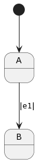
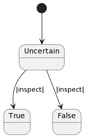
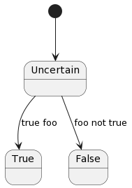

==================
Frame Control Flow
==================

Frame supports two flavors of branching:

#. An if-then-else like syntax
#. A pattern matching syntax

The basic syntax for both classes of test are:

.. code-block::

    x ?<type> <branches> : <else clause> ::

The : token is “else” and :: terminates the statement for all branching
statement types. Let’s explore the boolean test first.

Boolean Tests
-------------

The basic boolean test in Frame is:

.. code-block::

    x ? callIfTrue() : callIfFalse() ::

This syntax generates the following `C#` code:

.. code-block::

    if (x) {
        callIfTrue_do();
    } else {
        callIfFalse_do();
    }

To reinforce the point that branching in Frame is not an expression evaluation,
see how we can call multiple statements inside each branch:

`Frame`

.. code-block::

    x ?
        a()
        b()
    :
        c()
        d()
    ::

`C#`

.. code-block::

    if (x) {
        a_do();
        b_do();
    } else {
        c_do();
        d_do();
    }

To negate the test use the ?! operator:

`Frame`

.. code-block::

    x ?! callIfFalse() : callIfTrue() ::

`C#`

.. code-block::

    if (!(x)) {
        callIfFalse_do();
    } else {
        callIfTrue_do();
    }

Next we will explore the Frame equivalent of the switch statement for string
matching.

Pattern Matching Statements
---------------------------

Frame uses a novel but easy to understand notation for switch-like statements:

.. code-block::

    test ?<type>
        /pattern1/ statements :>
        /pattern2/ statements :
                   statements ::

The currently supported operators are `?~` for string matching and `?#` for
number/range matching. The `:` token indicates else/default and `::`
terminates the pattern matching statement.

String Matching
---------------

The string matching statement looks like this:

`Frame`

.. code-block::

    name() ?~
    /Elizabeth/ hiElizabeth()   :>
    /Robert/    hiRobert()      :
                whoAreYou()     ::

And results in this code:

`C#`

.. code-block::

    if (name_do() == "Elizabeth") {
        hiElizabeth_do();
    } else if (name_do() == "Robert") {
        hiRobert_do();
    } else {
        whoAreYou_do();
    }

Frame also permits multiple string matches per pattern:

`Frame`

.. code-block::

    name() ?~
        /Elizabeth|Beth/ hiElizabeth()   :>
        /Robert|Bob/     hiRobert()      :
                         whoAreYou()     ::

With this output:

`C#`

.. code-block::

    if (name_do() == "Elizabeth") || (name_do() == "Beth") {
        hiElizabeth_do();
    } else if (name_do() == "Robert") || (name_do() == "Bob") {
        hiRobert_do();
    } else {
        whoAreYou_do();
    }

Number Matching
---------------

Number matching is very similar to string pattern matching:

`Frame`

.. code-block::

    n ?#
        /1/ print("It's a 1")   :>
        /2/ print("It's a 2")   :
            print("It's a lot") ::

The output is:

`C#`

.. code-block::

    if (n == 1)) {
        print_do("It's a 1");
    } else if (n == 2)) {
        print_do("It's a 2");
    } else {
        print_do("It's a lot");
    }

Frame can also pattern match multiple numbers to a single branch as well as
compare decimals:

`Frame`

.. code-block::

    n ?#
        /1|2/           print("It's a 1 or 2")  :>
        /101.1|100.1/   print("It's over 100")  :
                        print("It's a lot")     ::

The output is:

`C#`

.. code-block::

    if (n == 1) || (n == 2)) {
        print_do("It's a 1 or 2");
    } else if (n == 101.1) || (n == 100.1)) {
        print_do("It's over 100");
    } else {
        print_do("It's a lot");
    }

Branches and Transitions
------------------------

The default behavior of Frame is to label transitions with the message that
generated the transition. This is fine when an event handler only contains a
single transition:

`Frame`

.. code-block::

    #Branching_v1

      -machine-

        $A
            |e1| -> $B ^

        $B

    ##

However this leads to ambiguity with two or more transitions from the same
event handler:

`Frame`

.. code-block::

    #Branching_v2

      -machine-

        $Uncertain
            |inspect|
                foo() ?
                    -> $True
                :
                    -> $False
                :: ^

        $True

        $False

    ##

Transition labels provide clarity as to which transition is which:

`Frame`

.. code-block::

    #Branching_v3

      -machine-

        $Uncertain
            |inspect|
                foo() ?
                    -> "true foo" $True
                :
                    -> "foo not true" $False
                :: ^

        $True

        $False

    ##

Conclusion
----------

The three core branching statements - boolean test, string pattern match and
number pattern match - provide a surprisingly useful set of functionality for
most common branching needs despite currently being rather limited in
expressive power. Look for advancement in the robustness and capability of the
pattern matching statements in the future.
