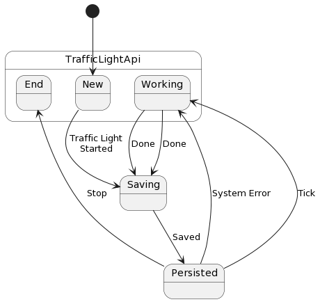

Persistance
===========

.. note::
    This topic is currently only supported in Golang.

Frame supports an experimental persistence pattern that is intended to
ultimately fit
into a larger system-of-systems architecture. The pattern entails creating
two symbiotic machines that work together to manage a domain of responsibility
as well as providing a flexible abstraction layer that adapts the generic
workflow to different possible environments.

.. note::
    Frame defines the term "workflow" to mean a persistable machine controller.

The first part of the pattern is the Frame language support for serialization.
The second is the role of the Machine Operating Machine (MOM) as an abstraction
layer between the core workflow object that the MOM manages and the environment.

.. note::
    Currently there is a tight coupling between the MOM and the workflow it
    manages with regards to serialization. This will be refactored in future
    releases.

Machine Serialization
---------------------

Frame supports serialization of machines through the simple
addition of a `Marshal` attribute to a system declaration:

.. code-block::

    #[derive(Marshal)]
    #SerializeSystemDemo

    -domain-

    var i:int = 42

    ##

The `Marshal` attribute causes the following additional code mechanisms to
be generated:

.. code-block::

    // defines a Marshal interface
    type Marshal interface {
        Marshal() []byte
    }

    // adds the Marshal interface to the system's interface
    type SerializeSystemDemo interface {
        Marshal
    }

    // defines a struct to use when serializing the system
    type marshalStruct struct {
        SerializeSystemDemoCompartment
        I int
    }

    // provides a method to execute the marshaling into JSON
    func (m *serializeSystemDemoStruct) MarshalJSON() ([]byte, error) {
        data := marshalStruct{
            SerializeSystemDemoCompartment: *m._compartment_,
            I: m.i,
        }
        return json.Marshal(data)
    }

    // provides a method to marshal into a byte data array
    func (m *serializeSystemDemoStruct) Marshal() []byte {
        data, err := json.Marshal(m)
        if err != nil {
            return nil
        }
        return data
    }

Now we need to be able to deserialize the data and hydrate the struct from
the serialized JSON data.

Machine Deserialization
-----------------------

To generate code to deserialize the workflow, the following attributes are
added to the Frame spec:

.. code-block::

    #[derive(Managed,Marshal)]
    #[mom="TrafficLightMom"]

The `Managed` attribute implies that a MOM will be defined for the workflow.
The `mom` attribute supplies the name of the MOM.

These attributes result in the following changes to the code:

.. code-block::

    type serializeSystemDemoStruct struct {
    mom TrafficLightMom	 // <--- mom field added to system
    _compartment_ *SerializeSystemDemoCompartment
    _nextCompartment_ *SerializeSystemDemoCompartment
    i int
}

The `mom` field is added to the system struct and must be passed in to both
the system factory:

.. code-block::

    func NewSerializeSystemDemo(mom TrafficLightMom ) SerializeSystemDemo {
        m := &serializeSystemDemoStruct{}
        m.mom = mom
        ...

as well as the new `Load` factory function:

.. code-block::

    func LoadSerializeSystemDemo(mom TrafficLightMom, data []byte) SerializeSystemDemo {
        m := &serializeSystemDemoStruct{}
        m.mom = mom

        // Validate interfaces
        var _ SerializeSystemDemo = m

        // Unmarshal
        var marshal marshalStruct
        err := json.Unmarshal(data, &marshal)
        if err != nil {
            return nil
        }

        // Initialize machine
        m._compartment_ = &marshal.SerializeSystemDemoCompartment

        m.i = marshal.I

        return m

    }

The `LoadXXX` factory takes both a MOM as well as the serialized workflow data
and rehydrates the system from the JSON. Notice that it restores both the
state compartment as well as the domain data.

So with Load now available the MOM has the tools it needs to manage Marshaling
and Unmarshaling the workflow.

Let us see an example of how a MOM manages the lifecycle of a workflow.

Persistence using a MOM
-----------------------

To demonstrate this from a working example let us examine a `demo of a
traffic light <https://github.com/frame-lang/frame-demos/tree/main/go/persistenttrafficlight>`_.

View the MOM spec using the online Framepiler playground `here <https://framepiler.frame-lang.org/gist/aHR0cHM6Ly9naXN0LmdpdGh1Yi5jb20vZnJhbWUtbGFuZy9mZjY1N2M1MGVjZWE1MjBlY2RjMzM4ODlkM2FkOGJhZg==>`_.
The `#TrafficLight` workflow it manages can be viewed `here <https://gist.github.com/frame-lang/59d483ec5e75604b6ec5e2e1f2a20176>`_.

The MOM's domain consists of a reference to the TrafficLight workflow it manages
as well as the raw serialized data for the workflow:

.. code-block::

    -domain-

    var trafficLight:TrafficLight = null
    var data:`[]byte` = null

Turning now to the operation of the MOM's machine, here is the UML for the
MOM spec:

At a glance, we can see that after initialization in the `$New` state the MOM
cycles through states `$Saving`, `$Persisted` and `$Working`.

The `$New` state begins operations by creating a new TrafficLight workflow
and passes a reference to itself using the # token:

.. code-block::

    $New => $TrafficLightApi
        |>|
            trafficLight = NewTrafficLight(#)
            -> "Traffic Light\nStarted" $Saving ^

`$New` then transitions into the `$Saving` state.

.. code-block::

    $Saving
        |>|
            data = trafficLight.Marshal()
            trafficLight = nil
            -> "Saved" $Persisted ^

Upon entry, `$Saving` marshals the data out of the TrafficLight workflow
and persists it in the MOM. This is not complete persistence to a durable
data store, but that step is a trivial addition. The reference to the
TrafficLight workflow is then set to nil and the MOM transitions to
the `$Persisted` state.

The `$Persisted` state then waits for a `|tick|` event to occur. If it does,
then the event is forwarded to the `$Working` state for processing. Alternatively
a `|systemError|` or `|stop|` event may occur sooner.

.. code-block::

    $Persisted
        |tick| -> "Tick"  =>  $Working ^
        |systemError| -> "System Error" =>  $Working ^
        |stop| -> "Stop" $End ^

The `|systemError|` will initiate a transition to `$Working` and forward
the event there for processing. `|stop|` will simply send the machine to the
`$End` state.

Upon entry the `$Working` state reloads the TrafficLight from the marshaled JSON
data. After the state is initialized, either the `|tick|` or the `|systemError|`
will be forwarded.

.. code-block::

    $Working => $TrafficLightApi
        |>|
            trafficLight = LoadTrafficLight(# data)  ^
        |tick|
            trafficLight.Tick() -> "Done" $Saving ^
        |systemError|
            trafficLight.SystemError() -> "Done" $Saving ^

Both the `|tick|` and the `|systemError|` events work in the same manner,
calling the corresponding interface on the workflow and then transitioning
back to `$Saving` to start the cycle over again.

Finally, and a bit oddly, entering the `$End` state requires loading the
workflow simply to tell it to stop:

.. code-block::

    $End => $TrafficLightApi
        |>|
            trafficLight = LoadTrafficLight(# data)
            trafficLight.Stop()
            trafficLight = nil ^

Conclusion
----------

This section has explored how two symbiotic systems can be organized to
achieve a persisted workflow. The MOM state machine should be generally
repurposable for managing the lifecycle other workflows and therefore is
a reusable "solution" to a general class of problems.

Likewise converting a "memory resident" controller like the TrafficLight into a
workflow (by definition persisted) is the matter of adding a couple of
attributes.

Frame is most certainly a very different
way to develop software. However, it is hoped that an ever
growing library of Frame solutions to common system design challenges
combined with powerful configurability will make
developing systems-of-systems with Frame an increasingly appealing choice 
for system architects and developers.
