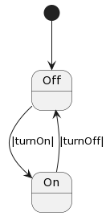
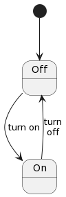

=============
Machine Block
=============

The Machine Block is the heart of the system and defines the system's state
machine. This section will introduce the core features of the
machine notation.

State Machines
--------------

State machines, or more accurately, Turing Machines, were invented by Alan
Turing in his `seminal 1936 paper <https://plato.stanford.edu/entries/turing-machine/>`_.

Although the paper is a complex mathematical proof, the logical device
he used to solve it is actually quite simple to understand. In fact, state machines
structure software much more intelligibly than the popular programming languages.

More on that later, but, in essence, state machines directly expose the
logical problem being solved rather than obscuring it. A simple example should
make this assertion clearer.

States
------

State identifiers in Frame are indicated by a ``$`` prefix:

.. code-block::

    $Off

Here we have a spec for a defective lamp:

.. code-block::

    #BrokenLamp

    -machine-

    $Off

    ##

Although rather useless to read by, the ``#BrokenLamp`` does illuminate an important
point - a state machine can have just a single state, in this case ``$Off``.
However it won't be
very exciting. We will increase the wattage on it very soon and add some more.

Start State
--------------

State machines always have a single designated
**start state**. In Frame the start state is always the very first state in
the spec, which in this case is ``$Off``.

Event Handlers
--------------

To make a state do something, it needs to be sent events. States handle events
with... event handlers.

.. code-block::

    #BrokenLamp

    -machine-

    $Off
        |turnOn|
            print("I'm broken.") ^

    ##

Event handlers start with a *message selector* ``|msg|`` and end with either a
*return* ``^`` or *continue* ``:>`` token.

Here we see that the ``$Off`` state handles the ``|turnOn|`` event by calling the
print function and then returning. In general, states can be described as
mapping events to **behavior**. Behavior comes in two big categories -
**taking action** and **transitioning**.

While this is somewhat trivial analysis, it is important when trying to
understand what makes a state a state. At its most essential, a state is an
**event map** that *uniquely* maps events to a set of behaviors. Therefore if
two states have exactly the same event map, they can be considered identical
(as well as redundant).

Taking Action
-------------

Taking action (as distinguished from calling a system action) means executing
general imperative behaviors. Those can include calling a system action,
however it can also include changing data, sending messages, calling global
functions and so on. In the broadest sense, "taking action" is **anything *except*
transitioning to a new state**. In this example, "doing something" is
simply printing a message.

Next we will explore the other category of behavior - transitioning to a new
state.

Transitioning
-------------

Transitions between states are effected using the ``->`` operator. Let's use it
to make a working lamp.

.. code-block::

    #Lamp

    -machine-

    $Off
        |turnOn| -> $On ^

    $On
        |turnOff| -> $Off ^
    ##

Notice how the transitions are labeled by default with the name of the message
that triggered the transition. Frame introduces **transition labels** which
allow for arbitrary labels to be used:

.. code-block::

    #Lamp

    -machine-

    $Off
        |turnOn| -> "turn on" $On ^

    $On
        |turnOff| -> "turn\noff" $Off ^
    ##

Now we have a working lamp, but all it does it oscillate between ``$Off`` and
``$On``. To do something, we need to be able to trigger activity when the
state changes.

System Events
-------------

We haven't yet discussed where events come from to drive the system. One
source is the outside world through the system interface, which will
be explained in the next section. Another source is the system itself when
a transition occurs.

Enter Event
^^^^^^^^^^^
Upon transitioning to a new state, the system sends an enter message ``|>|``
to the state that is being transitioned into.
This is used to trigger an event handler to initialize the state. Unlike
constructors for objects, there is nothing special about this event handler
other than the source of the message.

We can now update our state machine to use this event to turn the light on and
off.

.. code-block::

    #Lamp

    -machine-

    $Off
        |>|
            openSwitch() ^
        |turnOn|
            -> $On ^

    $On
        |>|
            closeSwitch() ^
        |turnOff|
            -> $Off ^
    ##

This is a perfectly fine way to implement a ``#Lamp``. However the system also
sends another message which we can use to accomplish the same functionality in
a slightly different way.

Exit Event
^^^^^^^^^^^
Upon transitioning out of the current state, the system sends an exit
message ``|<|`` to it first. Importantly, the exit event is sent to the current
state before the
enter event is sent to the next state. This allows so the current state can clean up before the new state initializes.

Here is how we can use that to accomplish the same functionality we have above:

.. code-block::

    #Lamp

    -machine-

    $Off
        |turnOn|
            -> $On ^

    $On
        |>|
            closeSwitch() ^
        |<|
            openSwitch() ^
        |turnOff|
            -> $Off ^

    -actions-

    closeSwitch
    openSwitch

    -domain-

    var color:string = "white"

    ##

We can see that the ``$On`` state now turns off the lamp when exiting.

Currently our machine doesn't provide a way to access the color variable.
Let's add getter and setter events to do so.

.. code-block::

    #Lamp

    -machine-

    $Off
        |turnOn|
            -> $On ^
        |getColor| : string
            ^(color)
        |setColor| [color:string]
            #.color = color ^

    $On
        |>|
            closeSwitch() ^
        |<|
            openSwitch() ^
        |turnOff|
            -> $Off ^
        |getColor| : string
            ^(color)
        |setColor| [color:string]
            #.color = color ^

    -actions-

    closeSwitch
    openSwitch
    setColor [color:string]
    getColor : string

    -domain-

    var color:string = "white"

    ##

Notice that the ``|getColor|`` event handler signature is typed to return a
string:

.. code-block::

    |getColor| : string
        ^(color)

To do so, the return token ``^`` is provided an expression to evaluate
that is returned. To set the color, the ``|setColor|`` event handler takes a color string and
sets the domain variable.

.. code-block::

    |setColor| [color:string]
        #.color = color ^ --- sets domain color variable with value of color param

The domain scope prefix ``#.`` differentiates between the
color parameter on the event handler and the domain variable. The event handler
parameter also has a scope identifier syntax as well: ``@[param]``.

So if we wanted to be completely clear we could also write this:

.. code-block::

    |setColor| [color:string]
        #.color = @[color] ^ --- using event parameter scope syntax

Event Handler Signatures
^^^^^^^^^^^^^^^^^^^^^^^^

Event handler signatures are the parameters and return value for an event
handler. All event handlers for a unique message must be identical, including
the names of the variables. If there
is an interface method that sends the message (as there usually is), then
all event handlers for that message must have an identical signature. If there
isn't an interface method for the message, then the first event handler for
the message defines the signature for the message.

.. code-block::

    -interface-

    write [data:string] : bool

    -machine-

    $Ready
        |write| [data:string] : bool
            ^(writeData(data))

    $StillReady
        |write| [data:string] : bool
            ^(writeData(data))

Above we can see that the ``write`` interface method defines the signature
for all event handlers for the ``|write|`` messge. The followign would produce
errors:

.. code-block::

    -interface-

    write [data:string] : bool

    -machine-

    $Ready
        |write| --- wrong! missing signature
            ^(writeData(data))

    $StillReady
        |write| [data:int] : bool --- wrong! data type changed
            ^(writeData(data))

As mentioned above, if an interface method is not present, then the first
event handler for a message will define the signature:

.. code-block::

    --- no interface definition for E1

    -machine-

    $Definition
        |E1| [a:int] : string --- so this handler defines the E1 message signature
            ^

    $DoesNotMatch
        |E1| [a:int] : bool --- wrong! returns bool not a string
            ^

    $Matches
        |E1| [a:int] : string --- ok!
            ^

An important point is that it is the *message* name that has a signature, not
the interface method. Interface methods, by default, generate a message with
the same name, unless they have an alias:

.. code-block::

    -interface-

    M1 : bool          --- message is "M1"
    M2 @(|M3|) [a:int] --- message is "M3", not "M2"

    -machine-

    $S0
        |M1| : bool  ^  --- ok!
        |M2| [a:int] ^  --- error! there is no M2 message
        |M3| [a:int] ^  --- ok!
