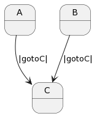
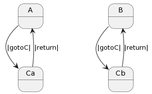
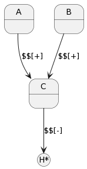
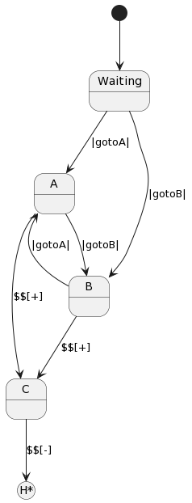
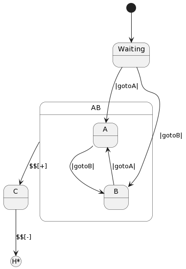

=============
State History
=============

Classical state machines (Turing machines for sticklers for accuracy)
permit, but do not define, any specific mechanisms for remembering historical
state transitions. This special case is common in use cases
where multiple states can transition to a particular state and then want
to return to the prior state.

An example of this would be a state that
manages a dialog that is useful in many different situations. Once it has
been dismissed the user wants to go back to whatever the prior context was.

To address this kind of scenario Statecharts introduce the “history” mechanism.

History 101
-----------

The following spec illustrates the limitation of state machines with regards
to history. Below we see states `$A` and `$B` both transitioning into, and
dead ending in, state `$C`.

.. code-block::

    #History101

      -machine-

        $A
            |gotoC| -> $C ^

        $B
            |gotoC| -> $C ^

        $C
            |return| ^

    ##

Here we see that $C has no way to know what state preceded it. To solve this
problem for a pure state machine we would have to do something like this:

.. code-block::

    #History102

      -machine-

        $A
            |gotoC| -> $Ca ^

        $B
            |gotoC| -> $Cb ^

        $Ca
            |return| -> $A ^

        $Cb
            |return| -> $B ^

    ##

$Ca and $Cb would be identical except for the response to the |return| message.
This is obviously inefficient.

The Solution
------------

Automata theory holds that there are are three levels of increasing complexity
and capability for abstract machines:

#. Finite State Machines
#. Pushdown Automata
#. Turing Machines

Pushdown Automata and Turning Machines share the trait of being able to store
information for future use. Pushdown Automata specifically use a stack for
storing history while Turning Machines theoretically have a “tape” to store
information on. In reality if a system can store off data and access it later
to make a decision it is effectively a Turing Machine.

For our problem with remembering the last state, a stack will do nicely thus
giving us the power of a Pushdown Automata. To support this, Frame has two
special operators:

.. list-table:: State Stack Operators
    :widths: 25 25
    :header-rows: 1

    * - Operator
      - Name
    * - $$[+]
      - State Stack Push
    * - $$[-]
      - State Stack Pop

Let’s see how these are used:

.. code-block::

    #History201

      -machine-

        $A
            |gotoC| $$[+] -> "$$[+]" $C ^

        $B
            |gotoC| $$[+] -> "$$[+]" $C ^

        $C
            |return| -> "$$[-]" $$[-] ^

    ##

What we see above is that the state stack push token precedes a transition to a
new state:

.. code-block::

    $$[+] -> $NewState

while the state stack pop operator produces the state to be transitioned into:

.. code-block::

    -> $$[-]

Recalling that FrameState is a delegate typedef in C# to allow references to
methods, we can see that Frame generates a _stateStack_ variable which is
initialized to a Stack<FrameState>() data structure. Also generated are the push
 and pop functions for the state stack operations.

.. note::
    Frame is in the process of converting from a code pattern focused on
     simple states to a new, more advanced concept of **compartments**.
    Compartments are a essentially a **state closure** data structure that
    has a state as one of its data members but also other data members that
    represent an *instance* of a state call. More about this later but for now
    where you see *state*, or *FrameState* these will soon be converted to
    the new compartments terminology as the code generators are updated.

.. code-block::

    //=========== Machinery and Mechanisms ===========//

    ...

    private Stack<FrameState> _stateStack_ = new Stack<FrameState>();

    private void _stateStack_push(FrameState state) {
        _stateStack_.Push(state);
    }

    private FrameState _stateStack_pop() {
        FrameState state =  _stateStack_.back();
        return _stateStack_.Pop();
    }

History 202
-----------

In our next example we will combine HSMs for refactoring behavior out of two
states and show how it can work together with the state history mechansism.

The History202 spec below starts in a `$Waiting` state and then transitions
to `$A` or `$B` depending on how the client drives it.

From there both states have an identical handler to transition to `$C`.

.. code-block::

    #History202

     -interface-

     gotoA
     gotoB
     gotoC
     goBack

     -machine-

       $Waiting
           |>| print("In $Waiting") ^
           |gotoA| print("|gotoA|") -> $A ^
           |gotoB| print("|gotoB|") -> $B ^

       $A
           |>| print("In $A") ^
           |gotoB| print("|gotoB|") -> $B ^
           |gotoC| print("|gotoC|") $$[+] -> "$$[+]" $C ^

       $B
           |>| print("In $B") ^
           |gotoA| print("|gotoA|") -> $A ^
           |gotoC| print("|gotoC|") $$[+] -> "$$[+]" $C ^

       $C
           |>| print("In $C") ^
           |goBack| print("|goBack|") -> "$$[-]" $$[-] ^

       -actions-

       print [msg:string]

   ##

.. raw:: html

    <iframe width="100%" height="475" src="https://dotnetfiddle.net/Widget/aofLnO" frameborder="0"></iframe>

Refactoring Common Behavior
---------------------------
Now lets refactor the common event handler into a new base state.

.. code-block::

    #History203

       -interface-

       gotoA
       gotoB
       gotoC
       goBack

       -machine-

       $Waiting
           |>| print("In $Waiting") ^
           |gotoA| print("|gotoA|") -> $A ^
           |gotoB| print("|gotoB|") -> $B ^

       $A => $AB
           |>| print("In $A") ^
           |gotoB| print("|gotoB|") -> $B ^

       $B => $AB
           |>| print("In $B") ^
           |gotoA| print("|gotoA|") -> $A ^

       $AB
           |gotoC| print("|gotoC| in $AB") $$[+] -> "$$[+]" $C ^

       $C
           |>| print("In $C") ^
           |goBack| print("|goBack|") -> "$$[-]" $$[-] ^

       -actions-

       print [msg:string]

    ##

We can see that the duplicated |gotoC| event handler is now moved into $AB and
both $A and $B inherit behavior from it.

.. raw:: html

    <iframe width="100%" height="475" src="https://dotnetfiddle.net/Widget/U1axyV" frameborder="0"></iframe>

.. note::
    History203 demonstrates the recommended best practice of using a Frame
    specification to define a base class (in this case _History203_) and then
    derive a subclass to provide the implemented actions for behavior.

Conclusion
----------

The History mechanism is one of the most valuable contributions of Statecharts
to the evolution of the state machine.

This article introduced the base concept and use case for state history and
showed its implementation in Frame. In addition, it showed how it works in
conjunction with Hierarchical State Machines. The combination of these two
capabilities makes Statecharts and Frame a powerful and efficient way to both
model and create complex software systems.
