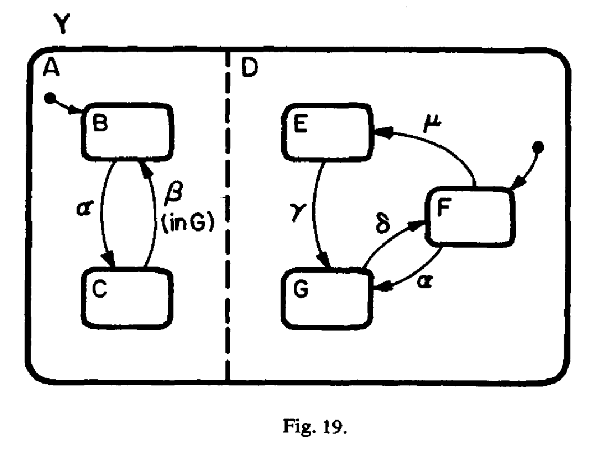

==================
Orthoganal Regions
==================

In Dr. David Harel's
`1987 paper <https://www.sciencedirect.com/science/article/pii/0167642387900359>`_
introducing his concept of Statecharts, one of the key concepts was
**Orthogonal Regions**. In essence, orthogonal regions are Statecharts way of
defining parallelism visually. This is an inherient aspect to designing
systems-of-systems, which is the definition of most truly complex software.

[Harel 1987]

The image above shows Harel's concept of orthogonal regions directly. Y is
an enclosing state that supports having two state machines (A and D) running in
parallel when Y is active.

Frame does not have notation or visual support for orthogonal regions.
However this is an important challenge to address.

It is the author's opinion that Frame should evolve to better express
system-of-systems architecture using concepts
from `the actor model <https://en.wikipedia.org/wiki/Actor_model>`_.

Simply put, the actor model is an architectural approach to system design
based on concurrently running processes communicating through message passing.
The opportunities for Frame to innovate as a language are to be able to:

#. Express infrastructure topology such as networking channels and messages.
#. Provide  associations between systems and system states based on
their relationships expressed via shared communication protocols.

This is an area for future research, but will most likely evolve Frame
to include declarative languages such as Terraform and KRM to define
infrastructure - the substrate - that Frame processes manage and run on.
This will progress Frame into becoming a polyglot language
that absorbs useful languages into its standard, as well as being adopted
inside of them as appropriate for expressing process and protocols.
